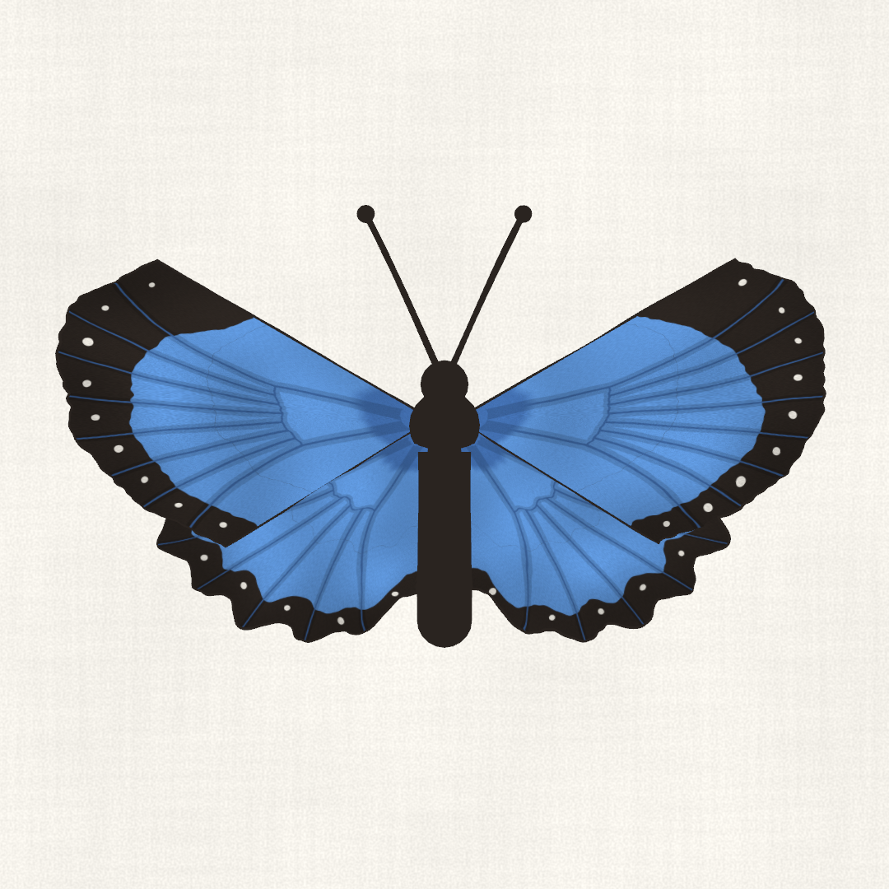
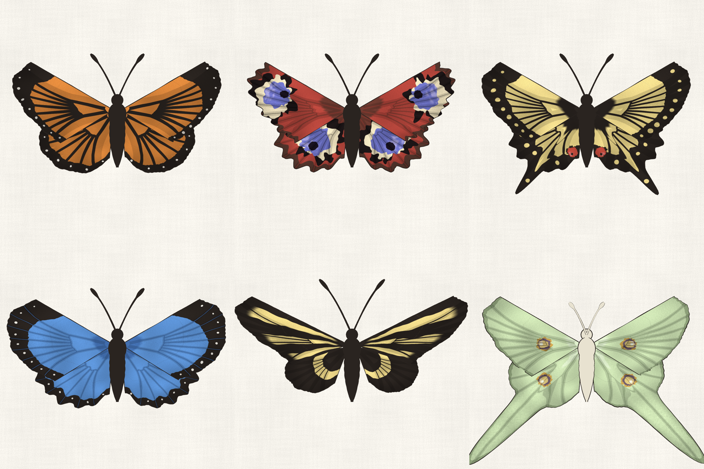
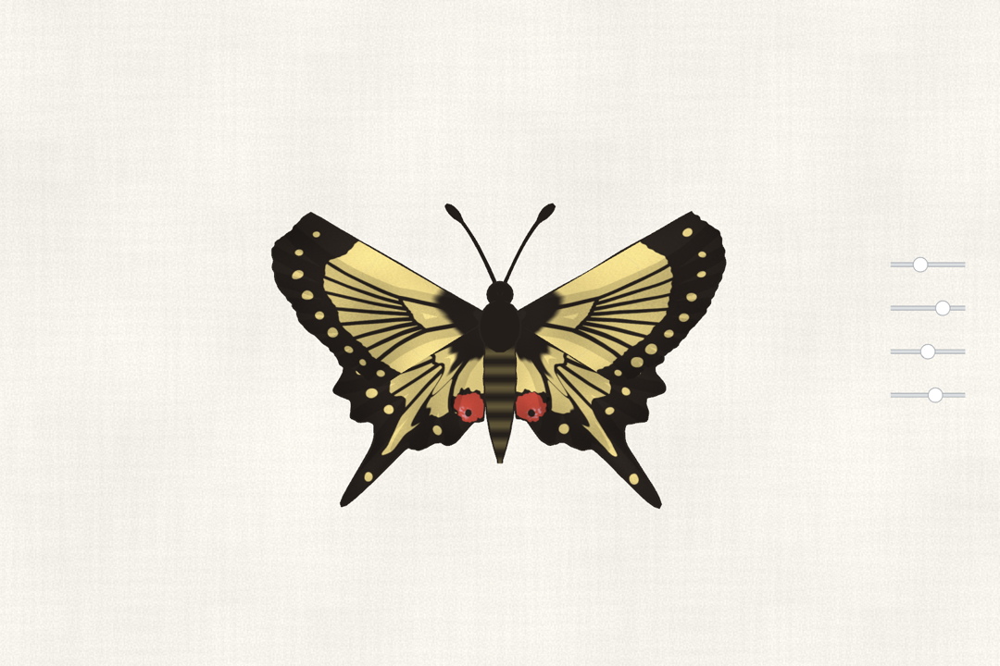
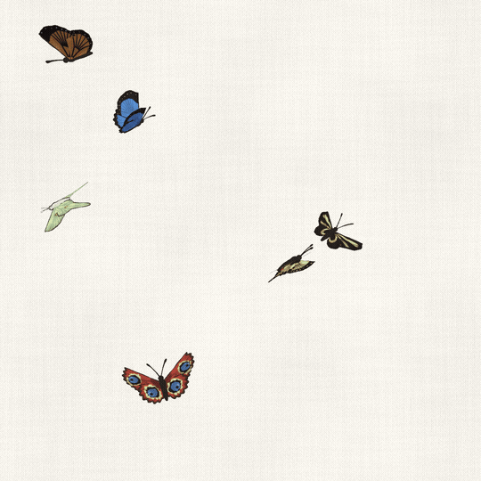

# butterfly-gen

Procedural butterflies in Unity. No models, no textures from disk. Wings are polar shapes grown from the body, the paint on them is computed per pixel on the CPU, and a small toon shader draws everything with a slightly wobbly ink line on top of a paper background.



## Wings

Each wing lives in polar coordinates around its root. `t` sweeps from the leading edge to the inner edge, `s` runs from the root out to the rim. The outline radius is a Catmull-Rom curve through seven control points, scalloped between the veins, with an optional gaussian tail on the hindwing. A little low-frequency noise tears the edge so no two wings are identical (left and right get their own seed, like real ones).

Veins follow the lepidopteran groundplan. They fan out from a closed discal cell, and the colour zones hang off that structure: basal flush, a band across the middle, stripes between veins, a dark margin with a row of spots, apex patches. All of it gets pushed around by a gentle domain warp. Then comes a pigment pass: tone noise, grain stretched along the scales, a soft shadow beside each vein and a darker rim.

Eyespots aren't rings. Each one is four colour masses (dark halo, cream, blue, pupil), and each mass has its own centre, stretch, teardrop bias and noisy outline. Where the halo outline dips under the cream you get broken black patches instead of a continuous circle. Anisotropic noise (fine across the veins, coarse along them) makes the colours bleed outward the way scales do.

The whole atlas is 2048² for four wings and paints in parallel.

## Species

Six presets: monarch, peacock, swallowtail, morpho, zebra longwing and luna moth. Every field blends with its neighbours through reflection (floats, colours, arrays, nested wing settings), so the species slider morphs one butterfly into the next.



## Sliders

A column on the right edge. Drag a handle and the wings ease into the new shape. While values move, the pattern repaints into a 512² draft atlas. Once they settle it repaints at full size. Drag anywhere else to orbit.

```
species    which preset, blended in between
eyes       eyespot size, off to double
pattern    width of margins, bands, stripes and apex patches
tail       hindwing tail, none to extra long
```



## Flight

Each wing is its own hinged mesh, so a wingbeat is just a rotation and never rebuilds anything. Downstroke takes 42% of the cycle and the hindwing lags a touch. Amplitude and rate jitter per beat, and now and then a butterfly stops flapping and glides for a moment while it sinks.

`Flight.unity` lets six of them loose. They steer along a curl noise field that drifts over time, get pulled back softly when they wander off, bank into turns and bob with every downstroke.



## Running it

Unity 6000.3.5f2 with URP 17.3 and the Input System. Open `Assets/Scenes/Butterfly.unity` for one butterfly with sliders or `Assets/Scenes/Flight.unity` for the swarm, then press Play.

## Layout

```
WingShape          polar outline, veins, ragged edge
WingPattern        groundplan colour zones, warp, pigment
Eyespot            eyespots as irregular colour masses
WingPainter        paints the four-wing atlas in parallel
ButterflyGeometry  wing meshes and the body
ButterflySpecies   presets and blending between them
ButterflyDials     the slider column
WingBeat           flap curve
ButterflyFlight    curl noise steering, glides, banking
PaperBackdrop      tileable paper behind the camera
ButterflyFlat      the shader, two-tone light plus an ink pass
```

## License

MIT
